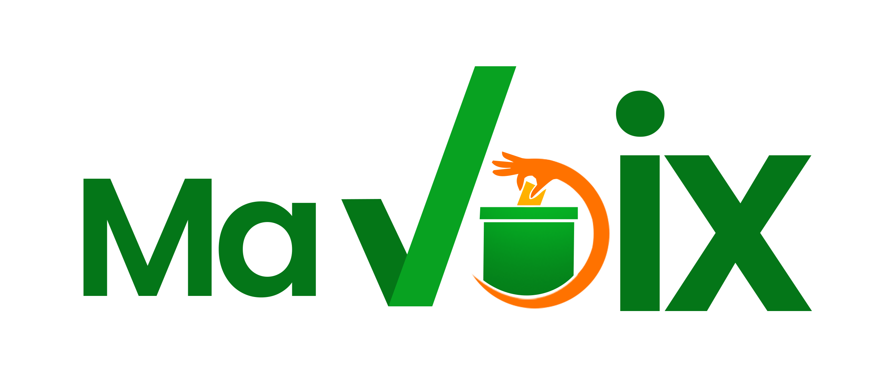

# Bienvenue dans MaVoix - Votre Portail Démocratique en Ligne!

Notre application web révolutionnaire, développée avec passion par l'équipe The Process en utilisant la technologie Flutter, est conçue pour élever le processus démocratique à de nouveaux sommets. MaVoix offre à la fois aux électeurs et aux candidats politiques un espace dynamique pour s'impliquer, s'exprimer et interagir de manière significative. Nous croyons fermement que chaque voix compte et que chaque citoyen a le pouvoir d'influencer le cours de notre avenir collectif.

## Fonctionnalités clés pour les électeurs:

- Participer aux Sondages Électoraux: Votre opinion compte! Exprimez vos préférences et vos opinions sur des questions cruciales grâce à notre plateforme de sondages en temps réel. Vos réponses contribuent à façonner le paysage politique.

- Analyser les Propositions de Programmes: Plongez dans les détails des propositions de programmes des candidats. Comparez, analysez et prenez des décisions éclairées en fonction de vos valeurs et de vos priorités.

- Interagir lors de Débats en Direct: Soyez au cœur de l'action politique en participant à des débats en direct. Posez des questions aux candidats, écoutez leurs réponses et engagez-vous dans des discussions stimulantes avec d'autres électeurs.

## Avantages pour les candidats et les partis politiques:

- Communiquer Directement avec les Électeurs: Notre plateforme offre aux candidats un moyen direct de communiquer leurs propositions et leurs idées aux électeurs. Partagez vos visions et établissez un lien personnel avec votre base de soutien.

- Renforcer la Transparence: Faites preuve de transparence envers les électeurs en fournissant des informations détaillées sur vos objectifs et vos plans. Établissez la confiance en partageant ouvertement votre vision pour le pays.

- Engagement Civique Renforcé: Encouragez l'engagement civique en offrant aux électeurs la possibilité de participer activement à votre campagne. Impliquez-les dans des discussions significatives pour créer une véritable communauté autour de votre candidature.

Notre mission est de favoriser une démocratie vivante, où les électeurs sont informés, les candidats sont accessibles et la participation est encouragée. Rejoignez-nous dans cette aventure passionnante pour un avenir politique plus ouvert, transparent et participatif.

Téléchargez MaVoix dès aujourd'hui et faites entendre votre voix!

Pour toute question ou assistance, veuillez nous contacter à [adresse e-mail de contact](mailto:adresse_e-mail).

## Avoir accès à l'application

Pouvoir avoir accès à l'application, cliquez sur le lien suivant : [Ma Voix](https://ma-voix-c555a.web.app)

*Ensemble, nous créons l'avenir de la démocratie.*

